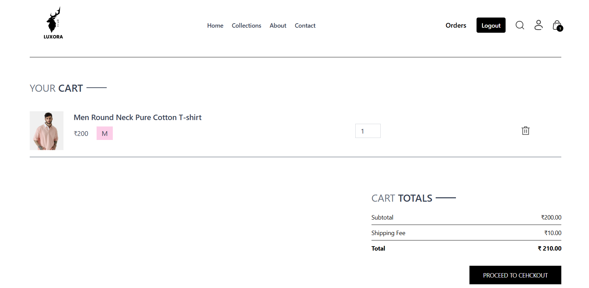
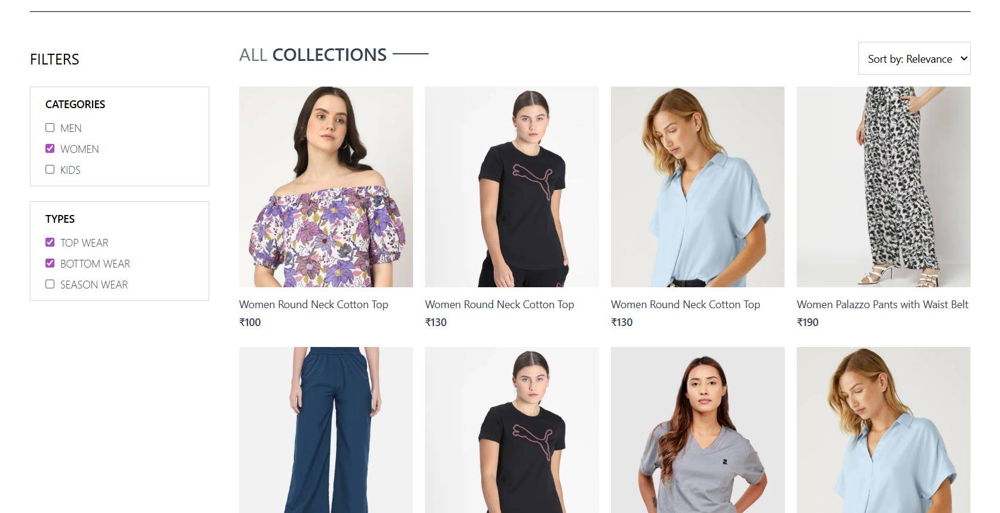
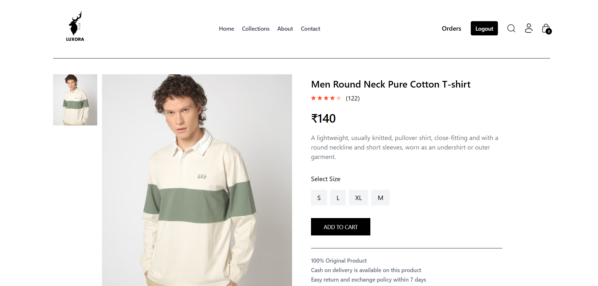

🛍 MERN E-Commerce Website
[](LICENSE)

A fully functional MERN stack e-commerce platform with a modern user interface, smooth scrolling animations, secure payment integration, and an admin panel for product management.

## 🚀 Features  

### **User Side**  
- 🏠 **Browse Products** – Modern, responsive, and user-friendly interface  
- 🛒 **Cart Management** – Add, update, and remove items from the cart  
- 💳 **Multiple Payment Options** – Secure online payments (Stripe) & Cash on Delivery (COD)  
- 📱 **Responsive Design** – Optimized for mobile, tablet, and desktop  
- 🎯 **Smooth Animations** – Enhanced scrolling experience using **Lenis**  

### **Admin Side**  
- 📦 **Product Management** – Add, edit, and delete products easily  
- 📊 **Order Management** – View, process, and update order statuses  
- 🔑 **Secure Authentication** – Admin-only access to the dashboard  

## Tech Stack

### **Frontend**  
- **React.js** – Component-based UI development  
- **Tailwind CSS** – Utility-first CSS framework for styling  
- **Axios** – For API calls and data fetching  
- **Lenis** – Smooth scrolling animations  

### **Backend**  
- **Node.js** – JavaScript runtime environment  
- **Express.js** – Web application framework for Node.js  
- **MongoDB** – NoSQL database for storing application data  
- **Mongoose** – ODM for MongoDB  
- **Stripe API** – Secure payment gateway integration  
- **Multer** – Middleware for handling file uploads


## Screenshots

<table>
  <tr>
    <td></td>
    <td></td>
  </tr>
  <tr>
    <td></td>
    <td></td>
  </tr>
</table>

## 📂 Project Structure  

mern-ecommerce/  
│
├── 📁 admin/   
│ ├── 📁 public/   
│ ├── 📁 src/   
│ │ ├── 📁 assets/   
│ │ ├── 📁 components/   
│ │ ├── 📁 pages/   
│ │ ├── 📄 App.jsx  
│ │ ├── 📄 index.js   
│ │ └── 📄 index.css   
│ ├── 📄 package.json  
│ ├── 📄 tailwind.config.js  
│ ├── 📄 postcss.config.js  
│ └── 📄 vite.config.js   
│
├── 📁 backend/  
│ ├── 📁 config/  
│ ├── 📁 controllers/   
│ ├── 📁 middlewares/   
│ ├── 📁 models/   
│ ├── 📁 routes/  
│ ├── 📁 utils/   
│ ├── 📄 server.js   
│ ├── 📄 .env   
│ └── 📄 package.json   
│
├── 📁 frontend/   
│ ├── 📁 public/  
│ ├── 📁 src/  
│ │ ├── 📁 assets/  
│ │ ├── 📁 components/   
│ │ ├── 📁 pages/   
│ │ ├── 📁 context/   
│ │ ├── 📄 App.jsx   
│ │ ├── 📄 index.js   
│ │ └── 📄 index.css   
│ ├── 📄 package.json   
│ ├── 📄 tailwind.config.js    
│ ├── 📄 postcss.config.js   
│ └── 📄 vite.config.js   
│
├── 📄 .gitignore  
├── 📄 package.json  
├── 📄 README.md  
└── 📄 LICENSE 


## Installation

Install my-project with npm

```bash
  npm install my-project
  cd my-project
```
    ## ⚙️ Installation & Setup

Follow these steps to run the project locally:

### 1️⃣ Clone the Repository
```bash
git clone https://github.com/LuckyBaliyan/mern-ecommerce.git
cd mern-ecommerce

2️⃣ Install Dependencies
Backend

bash
Copy
Edit
cd backend
npm install
Frontend

bash
Copy
Edit
cd ../frontend
npm install
Admin Panel

bash
Copy
Edit
cd ../admin
npm install

3️⃣ Set Up Environment Variables
Create a .env file inside the backend folder and add the following:

env
Copy
Edit
PORT=5000
MONGO_URI=your_mongodb_connection_string
JWT_SECRET=your_jwt_secret
STRIPE_SECRET_KEY=your_stripe_secret_key
CLOUDINARY_CLOUD_NAME=your_cloudinary_name
CLOUDINARY_API_KEY=your_cloudinary_api_key
CLOUDINARY_API_SECRET=your_cloudinary_api_secret

4️⃣ Run the Development Servers
Backend

bash
cd backend
npm run dev
Frontend

bash
cd ../frontend
npm run dev
Admin Panel

bash
Copy
Edit
cd ../admin
npm run dev

5️⃣ Open in Browser

Frontend (User Site): http://localhost:5173
Admin Panel: http://localhost:5174
Backend API: http://localhost:5000


## API Reference

#### Get all items

```http
  GET /api/items
```

| Parameter | Type     | Description                |
| :-------- | :------- | :------------------------- |
| `api_key` | `string` | **Required**. Your API key |

#### Get item

```http
  GET /api/items/${id}
```

| Parameter | Type     | Description                       |
| :-------- | :------- | :-------------------------------- |
| `id`      | `string` | **Required**. Id of item to fetch |

#### add(num1, num2)

Takes two numbers and returns the sum.


## 📡 API Documentation

The backend provides RESTful APIs for managing products, users, orders, and payments.

### 🔹 Base URL 
http://localhost:5000/api


---

### 🛍 Product Routes
| Method | Endpoint            | Description                  | Auth Required |
|--------|--------------------|------------------------------|--------------|
| GET    | `/products`        | Get all products             | ❌ No         |
| GET    | `/products/:id`    | Get single product by ID     | ❌ No         |
| POST   | `/products`        | Create a new product         | ✅ Admin      |
| PUT    | `/products/:id`    | Update a product by ID       | ✅ Admin      |
| DELETE | `/products/:id`    | Delete a product by ID       | ✅ Admin      |

---

### 👤 User Routes
| Method | Endpoint           | Description                  | Auth Required |
|--------|-------------------|------------------------------|--------------|
| POST   | `/users/register` | Register a new user          | ❌ No         |
| POST   | `/users/login`    | Login user                   | ❌ No         |
| GET    | `/users/profile`  | Get logged-in user profile   | ✅ Yes        |
| PUT    | `/users/profile`  | Update user profile          | ✅ Yes        |

---

### 📦 Order Routes
| Method | Endpoint           | Description                  | Auth Required |
|--------|-------------------|------------------------------|--------------|
| POST   | `/orders`         | Create a new order           | ✅ Yes        |
| GET    | `/orders/:id`     | Get order by ID              | ✅ Yes        |
| GET    | `/orders`         | Get all orders (Admin)       | ✅ Admin      |
| PUT    | `/orders/:id/pay` | Mark order as paid           | ✅ Yes        |
| PUT    | `/orders/:id/deliver` | Mark order as delivered  | ✅ Admin      |

---

### 💳 Payment Routes
| Method | Endpoint           | Description                  | Auth Required |
|--------|-------------------|------------------------------|--------------|
| POST   | `/payments/stripe`| Process Stripe payment       | ✅ Yes        |

---

### 🔐 Authentication
- Protected routes require a **Bearer Token** in the `Authorization` header:


---

### 📌 Example Request (Create Product)
```bash
POST /api/products
Content-Type: application/json
Authorization: Bearer <admin_jwt_token>

{
  "name": "New Product",
  "price": 1999,
  "description": "A great product",
  "category": "Electronics",
  "countInStock": 10,
  "image": "https://example.com/image.jpg"
}

Response:

{
  "message": "Product created successfully",
  "product": {
    "_id": "64b1a5c2f21c9f0d88a7f123",
    "name": "New Product",
    "price": 1999,
    "description": "A great product",
    "category": "Electronics",
    "countInStock": 10,
    "image": "https://example.com/image.jpg"}
}

```
# Contributing

We welcome contributions to improve this project! Follow these steps:

1. Fork the repository.

2. Clone your fork.
``` bash
git clone https://github.com/<your-username>/mern-ecommerce.git
cd mern-ecommerce
```
3. Create a new branch.
```bash
git checkout -b feature/your-feature-name
```
4. Make your changes.

5. Commit your changes.
```bash
git add .
git commit -m "Add: your descriptive commit message"
```
6. Push to your branch.
```bash
git push origin feature/your-feature-name
```

7. Open a pull request from your fork and describe your changes clearly.

**Contribution Guidelines**

- Keep code clean and readable.
- Do not commit sensitive information (like .env values).
- Test your code before submitting a PR.
- Respect existing design patterns.

## License

[MIT](https://choosealicense.com/licenses/mit/)

## 📜 License

This project is licensed under the **MIT License**.

You are free to:

- ✅ Use it for **learning purposes**.  
- ✅ Modify and adapt it for your own projects.  
- ✅ Share it with attribution to the original author.

---

**Disclaimer:**  
This project is intended **for educational purposes only**. While you are free to use and modify the code, the author assumes **no liability** for any issues arising from its use in production environments.

---

## 📬 Contact

Feel free to reach out if you have questions, suggestions, or just want to connect!  

- **GitHub:** [LuckyBaliyan](https://github.com/LuckyBaliyan)  
- **LinkedIn:** [Lucky Baliyan](https://www.linkedin.com/in/lucky-baliyan-67b487299/)  
- **Email:** [baliyanlucky85@gmail.com](mailto:baliyanlucky85@gmail.com)  


